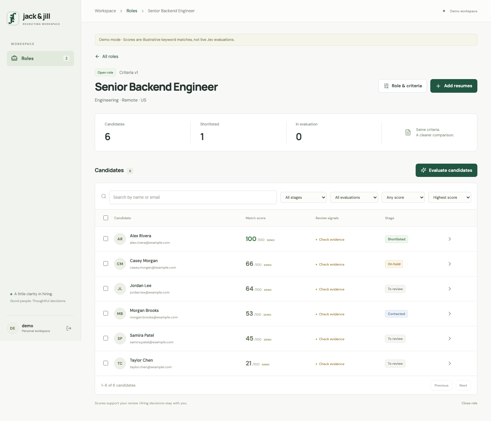

# HireLens

A quiet recruiting workspace built with Django, React/TypeScript, and Jev. Define a role, add resumes in batches, evaluate them against your criteria, and decide who deserves a conversation.



## What works

- Session sign-in with CSRF protection; each recruiter owns a private workspace.
- Roles with a job description, up to 12 weighted criteria, required-criterion flags, and open/closed state.
- Batch PDF, DOCX, and UTF-8 text intake; paste a resume; duplicate detection and per-file errors.
- Durable background evaluations with leases, bounded retries, restart recovery, and criterion-level Jev scores/confidence.
- Search, stage/status/score filters, server-side pagination, bulk evaluation and shortlisting.
- Candidate review with source resume text/download, editable contact details, notes, activity history, and saved outreach drafts.
- Versioned evaluations: changes to JD/criteria/title or scoring configuration make older results stale. Historical scores remain available.

Outreach opens an editable draft in your email application. It does not send messages. “Mark as contacted” records your manual action.

## Local setup

Requires Python 3.11+, [uv](https://docs.astral.sh/uv/), and Node 22.12+. SQLite works locally; PostgreSQL is supported through `DATABASE_URL`.

```sh
cd backend
cp .env.example .env
uv sync --extra dev --extra test
uv run python manage.py migrate
uv run python manage.py createsuperuser
cd ../frontend
npm ci
cd ..
./scripts/dev.sh
```

Open **http://127.0.0.1:5188** and sign in. The API runs on `127.0.0.1:8018`; the frontend proxies `/api` to it. The script runs the API, frontend, and worker together. Restart after backend changes. No Redis or Celery is needed.

### Connect Jev

Set these values in `backend/.env`, then restart all processes:

```dotenv
JEV_MODE=live
JEV_API_KEY=your-typesafe-api-key
JEV_MODEL=jev-1.13.0
```

Uses the [official TypeSafe HTTP API](https://docs.typesafe.ai/api), `POST https://api.typesafe.ai/v1/systemone`, with one [Score question](https://docs.typesafe.ai/primitives/score) per criterion. Keys stay on the server. Resume text and the job description are sent to TypeSafe when you evaluate. No API key is necessary to create jobs or add resumes.

Live responses have been tested against contract fixtures. A real provider call requires your key and has not been verified in this checkout.

### Explore with fictional data

```sh
cd backend
JEV_MODE=demo DEMO_PASSWORD='choose-a-local-password' uv run python manage.py seed_demo
cd ..
JEV_MODE=demo ./scripts/dev.sh
```

Sign in as `demo` with the password you chose. The seed command does not change an existing user's password. Demo results use a deterministic keyword-overlap function and are labeled throughout the UI; they are **not Jev scores**. Switching to live mode makes them stale and allows live re-evaluation without editing the role.

### Rank a local PDF corpus

For a folder containing raw PDF resumes, import and queue them against a job in one command. The job's saved criteria determine the marks and the candidate list is ranked by the current weighted score as evaluations complete:

```sh
cd backend
JEV_MODE=demo uv run python manage.py import_resume_folder --job-id 1 /path/to/resumes
```

Use `--recursive` for nested folders or `--no-evaluate` when you want to inspect the imported candidates first. The command extracts text, derives a name/email when available, stores the original PDF, skips duplicate resume content, reports unreadable files individually, and queues the current Job-1 rubric. Open the job's Candidates view and choose **Highest score** to see the ranked list. With `JEV_MODE=live`, set `JEV_API_KEY` first; the worker then calls Jev once per resume with all criteria in parallel.


### Verify

```sh
cd backend
uv run pytest
uv run ruff check recruiting tests/test_recruiting.py
uv run python manage.py check
uv run python manage.py makemigrations --check --dry-run
cd ../frontend
npm run build
npm run format:check
```

Browser tests require a running demo API, frontend, worker, and seeded account:

```sh
cd frontend
npx playwright install chromium
E2E_USERNAME=demo E2E_PASSWORD='your-demo-password' npm run test:e2e
```

The browser suite exercises role creation, partial upload failure, pasted resumes, asynchronous scores, shortlist actions, saved notes/drafts, stale criteria, filters, and a mobile viewport. Screenshots are under `docs/screenshots/`.

## Design and API

- [Recruiter flow, API contracts, architecture, and design alternatives](docs/design.md)
- [Review findings and verification](docs/review.md)
- [Imported backend and skills provenance](docs/provenance.md)

The backend extends your `django-base-code` project: `host/`, DRF routing, settings profiles, migrations, and the existing worker lifecycle. The requested productivity skills are installed under `.agents/skills`, `.cursor/skills`, and `.claude/skills`.

## Practical boundaries

This version provides private per-user workspaces, not shared organization accounts. PDF OCR, calendar scheduling, automatic email sending, and SSO are not implemented. Extraction is synchronous in batches of 20 files; evaluation runs asynchronously. Files are limited to 5 MB and extracted text to 40,000 characters. Scanned PDFs should be OCR'd or pasted as text.

For deployment, use PostgreSQL, a process supervisor for workers, persistent private media storage, a reverse proxy serving the UI and `/api` on the same HTTPS origin, and externally set `ENV=production`, `SECRET_KEY`, `ALLOWED_HOSTS`, and `DATABASE_URL`. The production settings require a non-default secret and secure cookies. Configure backups, retention/deletion procedures, and validate the scoring rubric against your own representative resumes before real recruiting use. No deployment has been performed.
